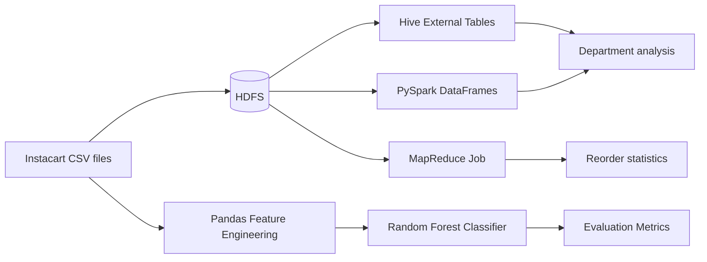

# Big Data Processing – Instacart Analytics


An end-to-end Big Data analytics pipeline on the **Instacart Market Basket** dataset. The project processes the same data with three distributed paradigms (**Hive**, **Spark**, **MapReduce**) and finishes with a **Random Forest** model that predicts product reordering behavior.

---

## Table of Contents

- [Overview](#overview)
- [Architecture](#architecture)
- [Tech Stack](#tech-stack)
- [Dataset](#dataset)
- [Repository Structure](#repository-structure)
- [Getting Started](#getting-started)
- [Components](#components)
  - [1. Hive (SQL on Hadoop)](#1-hive-sql-on-hadoop)
  - [2. PySpark (In-Memory DAG)](#2-pyspark-in-memory-dag)
  - [3. MapReduce (Java)](#3-mapreduce-java)
  - [4. Reorder Prediction (Machine Learning)](#4-reorder-prediction-machine-learning)
- [Known Limitations](#known-limitations)
- [Future Work](#future-work)
- [Author](#author)

---

## Overview

The goal is to compare how different distributed engines solve analytical problems on the same large-scale retail dataset, and to build a predictive model on top of engineered features.

| Task | Engine | Output |
|------|--------|--------|
| Top departments by purchased items | Hive / PySpark | Ranked department list |
| Reordered vs. new purchases | MapReduce (Java) | Two aggregate counts |
| Predict whether a user will reorder a product | scikit-learn Random Forest | Classification metrics |

## Architecture



## Tech Stack

- **Storage:** HDFS
- **Querying:** Apache Hive (HiveQL)
- **Processing:** Apache Spark (PySpark), Hadoop MapReduce (Java)
- **Machine Learning:** Python, pandas, scikit-learn
- **Environment:** Cloudera QuickStart VM (paths use `/user/cloudera/`)

## Dataset

[Instacart Market Basket Analysis](https://www.kaggle.com/c/instacart-market-basket-analysis/data) (Kaggle). Files used:

| File | Description |
|------|-------------|
| `orders.csv` | Order-level metadata (user, day, hour, etc.) |
| `order_products__prior.csv` | Products contained in prior orders |
| `products.csv` | Product catalog |
| `departments.csv` | Department lookup |
| `aisles.csv` | Aisle lookup |

> The dataset is not included in this repository because of its size. Download it from Kaggle.

## Repository Structure

| File | Purpose |
|------|---------|
| [`hive_queries.sql`](hive_queries.sql) | Hive DDL + distributed three-way join/aggregation query |
| [`pyspark_analysis.py`](pyspark_analysis.py) | PySpark version of the department analysis |
| [`ReorderCount.java`](ReorderCount.java) | MapReduce job: reordered vs. new purchases |
| [`reorder_prediction_ml.py`](reorder_prediction_ml.py) | Feature engineering + Random Forest model |
| [`README.md`](README.md) | Project documentation |

## Getting Started

### Clone the repository

```bash
git clone https://github.com/mohammedelsayed741996-blip/big-data-processing-instacart-analytics.git
cd big-data-processing-instacart-analytics
```

### Prerequisites

- Hadoop / HDFS, Hive, and Spark (or a Cloudera QuickStart VM)
- Java 8+ and a Hadoop client for compiling the MapReduce job
- Python 3.8+ with:

```bash
pip install pandas scikit-learn
```

### Load data into HDFS

```bash
hdfs dfs -mkdir -p /user/cloudera/instacart/{orders,order_products_prior,products,departments,aisles}

hdfs dfs -put orders.csv                 /user/cloudera/instacart/orders/
hdfs dfs -put order_products__prior.csv  /user/cloudera/instacart/order_products_prior/
hdfs dfs -put products.csv               /user/cloudera/instacart/products/
hdfs dfs -put departments.csv            /user/cloudera/instacart/departments/
hdfs dfs -put aisles.csv                 /user/cloudera/instacart/aisles/
```

## Components

### 1. Hive (SQL on Hadoop)

`hive_queries.sql` creates the `instacart_db` database and five **external tables** over the HDFS directories, then runs a three-way join (`order_products` → `products` → `departments`) to rank the top 10 departments by number of purchased items.

```bash
hive -f hive_queries.sql
```

### 2. PySpark (In-Memory DAG)

`pyspark_analysis.py` reproduces the same analysis using Spark DataFrames, letting Spark build an optimized in-memory execution plan (DAG) instead of chained MapReduce stages.

```bash
spark-submit pyspark_analysis.py
```

### 3. MapReduce (Java)

`ReorderCount.java` counts how many purchased items were **reordered** versus **new purchases**:

- **Mapper:** reads the `reordered` column and emits `("Reordered" | "New_Purchase", 1)`
- **Combiner / Reducer:** sums the counts per key

```bash
javac -classpath $(hadoop classpath) -d classes ReorderCount.java
jar -cvf reordercount.jar -C classes/ .

hadoop jar reordercount.jar ReorderCount \
    /user/cloudera/instacart/order_products_prior/ \
    /user/cloudera/instacart/output_reorder

hdfs dfs -cat /user/cloudera/instacart/output_reorder/part-r-00000
```

### 4. Reorder Prediction (Machine Learning)

`reorder_prediction_ml.py` builds user–product interaction features and trains a Random Forest classifier.

**Pipeline**

1. Join `order_products__prior` with `orders` to map each product to a user
2. Aggregate per `(user_id, product_id)`: `times_ordered`, `times_reordered`, `avg_cart_position`
3. Derive `reorder_ratio = times_reordered / times_ordered`
4. Split 80/20, standardize features, train `RandomForestClassifier(n_estimators=100, max_depth=10)`
5. Report accuracy and a classification report

```bash
# place orders.csv and order_products__prior.csv (renamed to order_products_prior.csv) beside the script
python reorder_prediction_ml.py
```

## Known Limitations

Being transparent about these makes the results easier to interpret:

- **Target leakage in the ML model.** The label is defined as `reorder_ratio > 0.5`, and `reorder_ratio` (plus `times_reordered`) is also used as an input feature. The model can therefore recover the label almost directly, so the reported accuracy will be unrealistically high and should not be read as real predictive power. A valid setup would use only features computed from earlier orders (e.g. via a time-based split using `order_number`) to predict the reorder behavior in a later order.
- **Metric naming.** The Hive/Spark query counts rows in `order_products` (purchased items), not distinct orders, so `total_orders` represents *items ordered per department*.
- **CSV parsing.** Product and aisle names may contain commas inside quotes. The plain `FIELDS TERMINATED BY ','` Hive tables and the `split(",")` MapReduce mapper do not handle quoted fields; consider `OpenCSVSerde` for the `products` and `aisles` tables. (The `reordered` column used by MapReduce is numeric, so that job is unaffected.)
- **Single-machine ML.** The Random Forest step runs in pandas/scikit-learn and does not scale like the Hive/Spark parts; Spark MLlib is the natural next step for very large data.

## Future Work

- Fix the leakage issue with a time-aware split and leakage-free features
- Port the ML stage to **Spark MLlib**
- Add richer features (days since prior order, product popularity, user habits)
- Compare model families (Gradient Boosting, XGBoost) and tune hyperparameters
- Benchmark Hive vs. Spark vs. MapReduce runtimes and document the results

## Author

**Mohammed Elsayed**
GitHub: [@mohammedelsayed741996-blip](https://github.com/mohammedelsayed741996-blip)

---

*Built as part of a Big Data Processing course project.*
